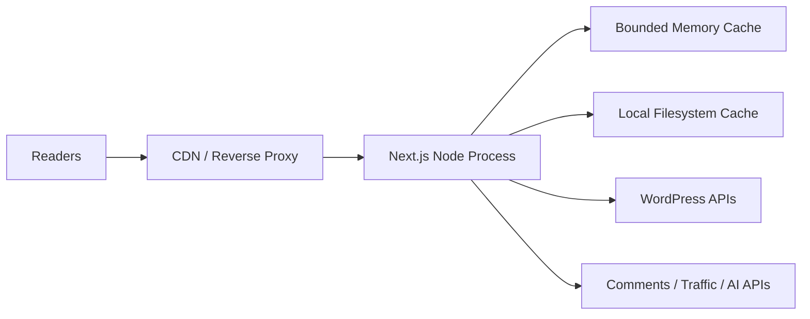

# Architecture Evolution

## Current Target

The current production target is one Node.js 22 application instance behind a
TLS-terminating reverse proxy or load balancer. Redis and Docker are not
required.

The memory cache handles hot requests and request deduplication. The filesystem
cache survives process restarts and provides stale-on-error content when an
upstream service is unavailable.

## Operational Boundaries

- `GET /api/health` is a cheap liveness check and does not call dependencies.
- `GET /api/health?readiness=1` validates required configuration and filesystem
  cache write access.
- `GET /api/health?deep=1` with `x-health-secret` additionally checks WordPress
  connectivity. Run this from monitoring, not on every load-balancer probe.
- WordPress remains the source of truth. Local caches are disposable and must
  never be treated as durable business data.
- `FILE_CACHE_MAX_BYTES` bounds local cache disk usage. Cleanup evicts expired
  entries first and then the oldest temporary entries.
- Process-local rate limits protect one instance. Enforce public traffic limits
  at the reverse proxy or CDN so they apply consistently before adding more
  instances.

## Growth Stages

### Current to 10x Traffic

Keep the application as a modular monolith. This avoids premature operational
complexity while the main scaling work remains cache and delivery efficiency.

1. Put anonymous pages and assets behind a CDN.
2. Run one active Node instance with a warm standby and documented rollback.
3. Move `.cache` to a dedicated persistent volume with disk alerts.
4. Add external uptime checks for liveness, readiness, and the deep health check.
5. Track WordPress latency, cache-hit ratio, 5xx rate, event-loop delay, memory,
   and disk utilization.
6. Enforce rate limits and request-size limits at the reverse proxy.

Move to multiple active application instances only when one instance cannot
meet the latency/SLO target after CDN caching and vertical scaling.

### 10x to 100x Traffic

Before running multiple active instances, replace process-local coordination:

- Use a shared cache provider or CDN cache for cross-instance content caching.
  Redis is one option, but a managed key-value service or CDN-native cache is
  equally valid.
- Move view tracking and other write-heavy events to a durable queue.
- Move scheduled cache cleanup and batch refresh work to a dedicated worker.
- Store rate-limit state at the edge or in a shared provider.
- Send logs, metrics, and traces to a centralized observability platform.

Do not split the modular monolith into microservices by technical layer. Extract
a capability only when it has independent scaling, ownership, or availability
requirements. Likely first candidates are traffic/view ingestion and AI chat.

## Migration Triggers

| Trigger | Required Change |
| --- | --- |
| Cache directory exceeds 500 MB or disk exceeds 70% | Add disk quota/alerts and shorten low-value TTLs |
| Sustained CPU above 70% or event-loop delay above 100 ms | Profile, scale vertically, then add instances |
| More than one active app instance | Replace local rate limits and invalidation with shared/edge coordination |
| WordPress p95 latency above 1 second | Increase CDN coverage and isolate expensive WordPress queries |
| Event writes affect page latency | Introduce an asynchronous durable queue |
| One capability requires separate deploy cadence or SLO | Consider extracting that capability |

## Architecture Decisions

- Keep a modular monolith now.
- Do not require Redis until horizontal scaling needs cross-instance state.
- Prefer CDN/reverse-proxy controls for public caching and rate limiting.
- Keep local filesystem cache as disposable resilience data.
- Separate liveness from dependency readiness to avoid cascading restarts.
